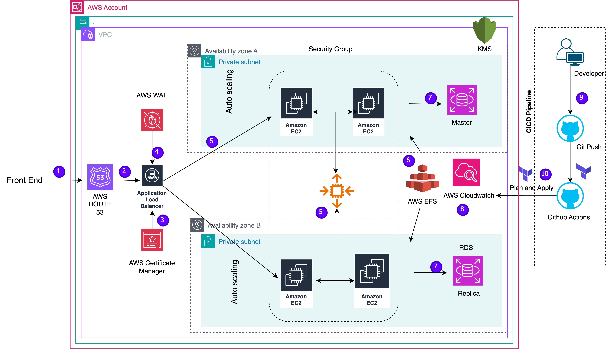

# Auto-Scaling EC2 with WAF, RDS, EFS, and Route53 (Terraform)

This project provisions a scalable and secure AWS infrastructure using Terraform. It includes EC2 Auto Scaling, WAF protection, RDS database, EFS storage, Route53 DNS, and all necessary networking components.

## Architecture Overview



## Resources Created

- **VPC & Networking**
  - VPC
  - Subnets (public/private)
  - Internet Gateway
  - NAT Gateway
  - Route Tables

- **Compute**
  - EC2 Auto Scaling Group
  - Launch Template with custom user data (`templates/user_data.tpl`)
  - Security Groups

- **Storage**
  - Amazon EFS (Elastic File System)

- **Database**
  - Amazon RDS (Relational Database Service)

- **Security**
  - AWS WAF (Web Application Firewall)

- **DNS**
  - Amazon Route 53 (Hosted Zone and DNS records)

## Files

- `vpc.tf` — VPC and networking resources
- `autoscaling.tf` — EC2 Auto Scaling Group and Launch Template
- `efs.tf` — EFS resources
- `rds.tf` — RDS resources
- `waf.tf` — WAF configuration
- `route_53.tf` — Route53 DNS setup
- `provider.tf` — AWS provider configuration
- `backend.tf` — Remote state backend configuration
- `local.tf` — Local values
- `variables.tf` — Input variables
- `output.tf` — Output values
- `templates/user_data.tpl` — EC2 instance bootstrap script
- `staging.terraform.tfvars` — Example variable values for staging

## How to Execute

1. **Configure AWS Credentials**
   - Ensure your AWS credentials are set in your environment (e.g., via `aws configure` or environment variables).

2. **Initialize Terraform**
   ```sh
   terraform init
   ```

3. **Review the Plan**
   ```sh
   terraform plan -var-file=staging.terraform.tfvars
   ```

4. **Apply the Configuration**
   ```sh
   terraform apply -var-file=staging.terraform.tfvars
   ```

5. **Check Outputs**
   - After apply, Terraform will show useful outputs such as DNS names, EFS IDs, RDS endpoints, etc.

## Customization

- Edit `variables.tf` and `staging.terraform.tfvars` to customize instance types, database settings, domain names, and other parameters.
- Modify `templates/user_data.tpl` for custom EC2 bootstrapping.
