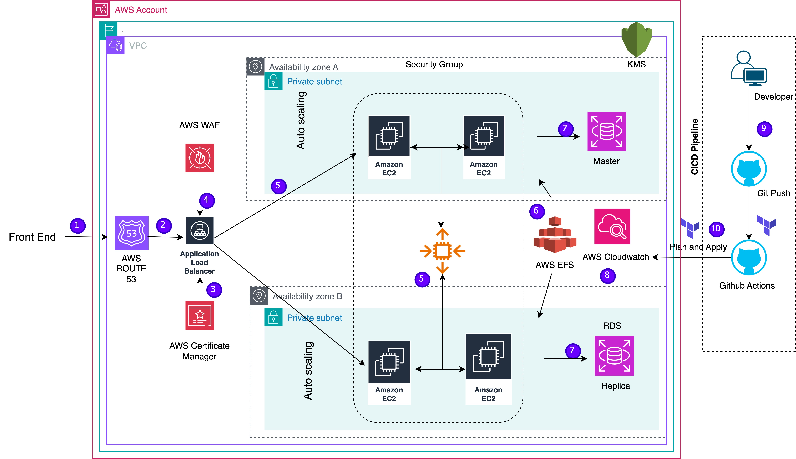

#  Web Application with High Availability in AWS

## Architecture Reference
  

https://dev.to/aws-builders/deploying-a-full-stack-aws-architecture-using-terraform-ensuring-high-availability-in-aws-5h31

## Infra Overview
The infrastructure is built as a multi-tier, highly available system.

1. Front End Request
A user or client sends a request to the application’s front end.

2. DNS Resolution via Route 53
The request first goes to AWS Route 53, which handles DNS resolution and directs traffic to the correct endpoint.

3. SSL/TLS Termination via AWS Certificate Manager 	
AWS Certificate Manager provides SSL/TLS certificates for secure communication between the client and the application.

4. Traffic Filtering via AWS WAF
AWS Web Application Firewall (WAF) inspects incoming requests for security threats and filters malicious traffic.

5. Load Balancing and Auto Scaling
The Application Load Balancer distributes incoming requests across multiple EC2 instances in different Availability Zones (A and B).
Auto Scaling ensures that the number of EC2 instances adjusts automatically based on demand.

6. Shared Storage via AWS EFS
EC2 instances access shared storage using Amazon Elastic File System (EFS), allowing them to read/write files as needed.

7. Database Access via Amazon RDS
EC2 instances connect to Amazon RDS for database operations.
RDS is configured with a master and a replica for high availability and failover.

8. Monitoring via AWS CloudWatch
AWS CloudWatch collects logs and metrics from the infrastructure for monitoring and alerting.

9. CI/CD Pipeline Initiation
Developers push code changes to GitHub.

10. Infrastructure Automation via Terraform (soon GitHub Actions)

Other Components:

Security Groups: Control inbound and outbound traffic to EC2 instances.  
KMS (Key Management Service): Manages encryption keys for securing data.

Terraform Steps
- terraform init 
- terraform plan --var-file=staging.terraform.tfvars  
- terraform apply --auto-approve --var-file=staging.terraform.tfvars 