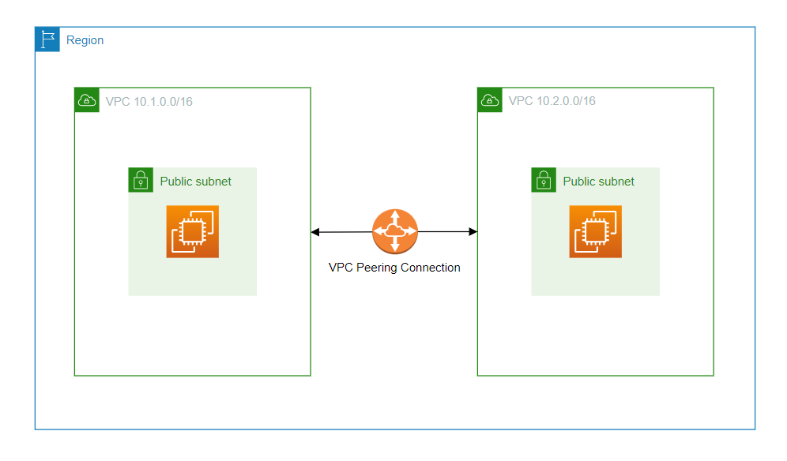

# VPC Peering Connection between two VPCs in same region

A VPC peering connection is a networking connection between two VPCs that enables you to route traffic between them using private IPv4 addresses or IPv6 addresses.

Create two VPCs with non-overlapping cidrs.  
Host EC2 instances in each VPC.  
Create a VPC peering connection with routes between the two VPCs.

https://dev.to/chinmay13/aws-networking-with-terraform-vpc-peering-connection-between-vpcs-4a2d